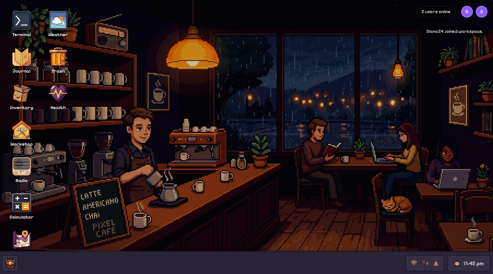
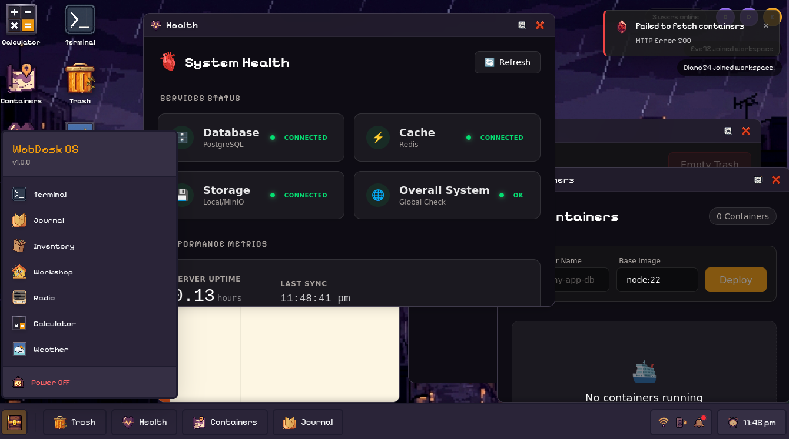
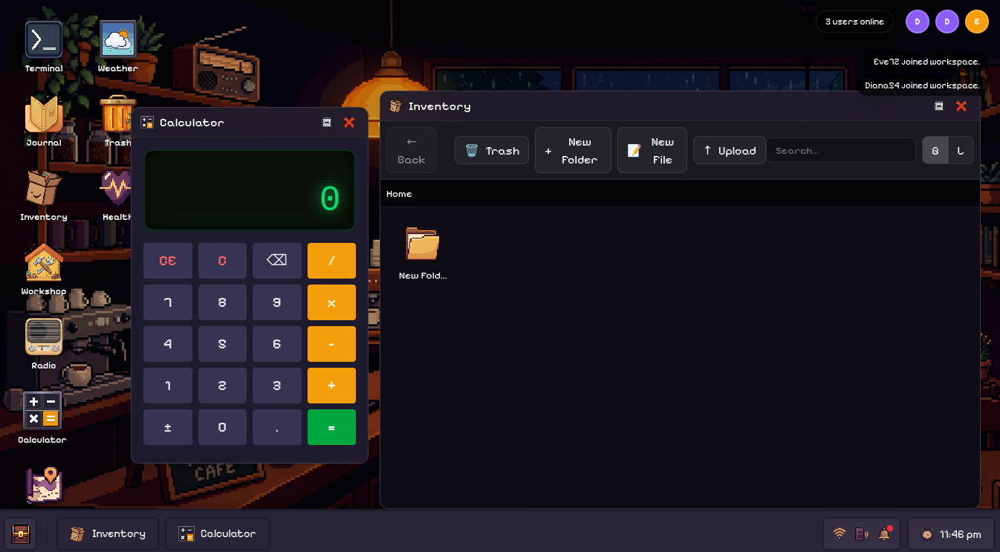
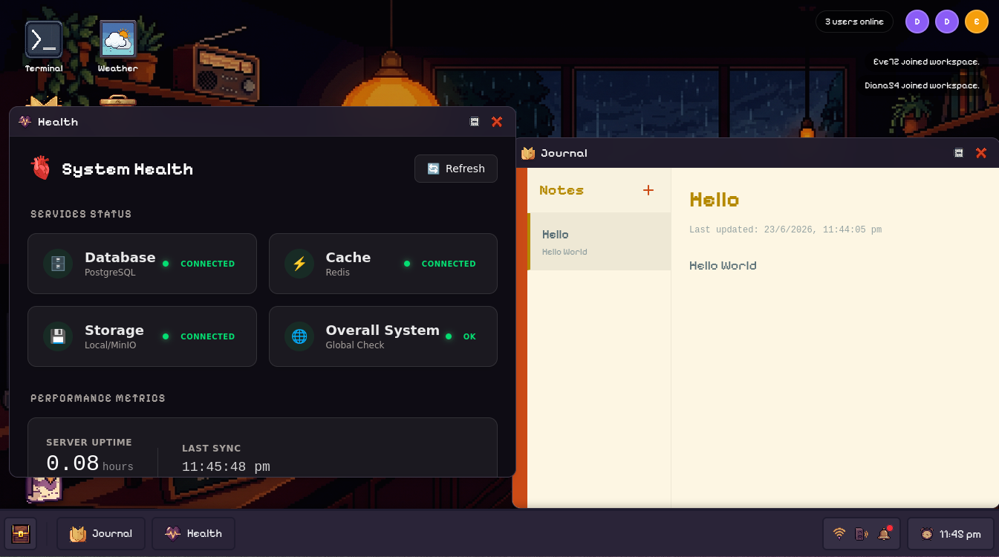
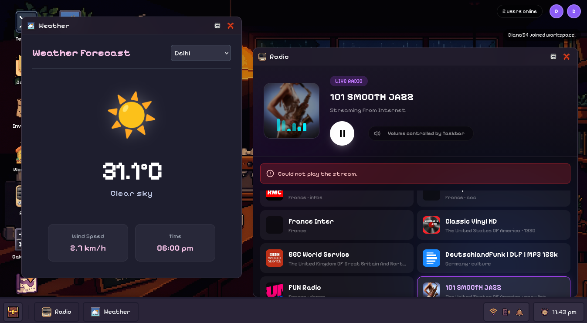

# Web-Desk OS

A fully-featured, browser-based operating system featuring a beautiful desktop environment, real-time interactive terminal, code editor, persistent virtual filesystem, and native window management. 

---

## 🚀 How to Run (Quick Start)

The absolute easiest way to run the entire Web-Desk OS ecosystem (Frontend, Backend, PostgreSQL Database, and Redis Cache) is by using Docker Compose.

### Prerequisites
* [Docker](https://docs.docker.com/get-docker/) installed and running.

### Start the OS
1. Clone this repository:
   ```bash
   git clone https://github.com/lokeshkonnka/web-desk.git
   cd web-desk
   ```
2. Build and start all services in the background:
   ```bash
   docker compose up -d --build
   ```
3. Open your browser and navigate to: **http://localhost:3000**

*That's it! Docker handles provisioning the PostgreSQL database, the Redis websocket cache, creating the unified React/Bun server, and mounting a local volume for persistent file storage.*

*(Note: To stop the OS and spin down the containers, run `docker compose down`)*

---

## 🛠 Tech Stack

Web-Desk is built using a modern, extremely fast edge-ready stack:

### Frontend (The Desktop UI)
* **Framework:** React 18 + Vite
* **Styling:** Vanilla CSS (Tailwind-free for maximum custom aesthetics) & Framer Motion (for fluid window animations)
* **State Management:** Zustand (System state, Audio, Notifications)
* **Components:** React-RND (Draggable & Resizable windows), Xterm.js (Terminal emulator)

### Backend (The Core Services)
* **Runtime:** Bun (Blazing fast JavaScript runtime)
* **Server:** Fastify (High-performance API framework)
* **Database & ORM:** PostgreSQL + Prisma
* **Real-time & RPC:** Socket.IO + Redis Adapter (For seamless terminal streams and multi-tab collaboration)
* **Storage:** Native Local Storage Adapter (S3/MinIO compatible)
* **Containerization:** Node-PTY (For spawning native bash processes) + Docker

---

## 📸 Screenshots

| Desktop Environment | System Overview |
| :---: | :---: |
|  |  |

| Tools (Calc & Inventory) | Productivity (Journal) | Weather & Radio |
| :---: | :---: | :---: |
|  |  |  |

---

## ✨ Key Features

* **Advanced Window Management:** Move, resize, maximize, minimize, and bring-to-front fluidly with native-feeling animations.
* **Persistent Virtual Filesystem:** Upload, download, and organize files in folders. The filesystem persists completely across reboots.
* **Interactive Native Terminal:** Open a real bash terminal in your browser powered by `node-pty` and WebSockets.
* **Integrated Apps:** 
  * *Code Editor:* Read and edit text/code files directly in the OS.
  * *ImageViewer:* Double-click images to view them natively on your desktop.
  * *Radio/Music Player:* Listen to music globally across the OS.
  * *Journal:* A rich-text note-taking app that auto-saves your thoughts.
* **Robust Taskbar & Notifications:** Features a global audio volume slider, WiFi diagnostic popups, a working analog clock, and a rich notification center with error/success histories.
* **Start Menu & Desktop Shortcuts:** Drag and drop your favorite applications straight from the start menu onto the desktop for easy access.
* **Power Lifecycle:** Authentic system boot-up screens and safe power-off sequences.
